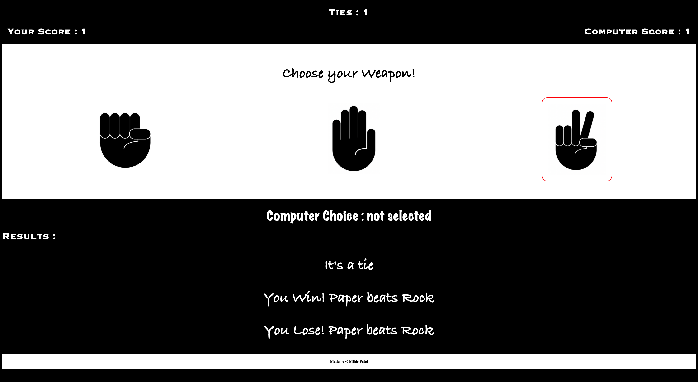

# 🎮 Rock Paper Scissors Game

A classic Rock Paper Scissors game implemented in JavaScript with a clean user interface. Play against the computer in a race to 5 wins!

[](https://developer.mozilla.org/en-US/docs/Web/JavaScript)
[](https://opensource.org/licenses/MIT)

 <!-- Add your screenshot here -->

## Features

- 🕹️ Interactive game interface with clickable choices
- 📊 Real-time score tracking
- 💻 Computer choice display
- 📝 Game explanation for each round
- 🔄 Reset game functionality
- 🎨 Smooth animations and visual feedback
- 📱 Responsive design

## How to Play

1. Choose between Rock, Paper, or Scissors by clicking the corresponding button
2. Computer makes random choice
3. See immediate results of each round
4. First to 5 points wins the game
5. Click "Play Again" to reset scores and start over

## Installation

1. Clone the repository:
```bash
git clone https://github.com/miihirr/rock-paper-scissors.git
